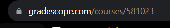

# GradeScraper

# HOW TO RUN 
1. Download Chromedriver exec version that matches your chrome from here https://chromedriver.chromium.org/
2. Install requirements.txt in a venv
3. Put in global variables
    1. DOWNLOAD_PATH - full folder path to downloading foldre
    2. EXECUTABLE_PATH - full path to where you stored the chromedriver exec
    3. EMAIL - gradescope email
    4. PWD - gradescope pwd
    5. ASSIGNMENT_NAME - name of assignment want to scrape NEEDS TO BE EXACT WITH SPACES
    6. COURSE_NUMBER - the number associated with the course when you click the button. It is in the url when you click it and is on the main page
    